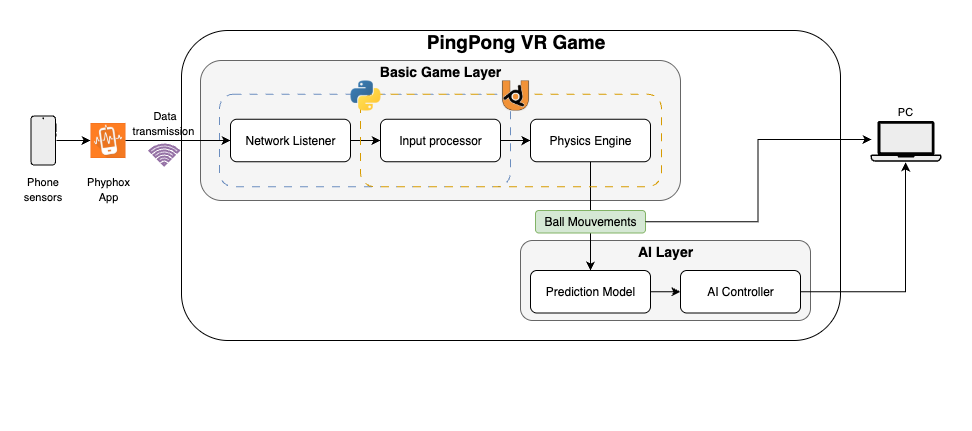

# Invincible : Virtual Reality Ping Pong game

<div align="center">
	
</div>


A 3D ping-pong game built with Blender and Python, controlled entirely by smartphone motion sensors (accelerometer and gyroscope) via a local UDP connection. [AI opponent in the making]

### High-level Architecture 


### How to use :

1. Clone the repo
2. Open main.blend in UPBGE
3. Download the Phyphox app, import [the pingpong experiment](assets/experiments/pingpong.phyphox) and enable remote access for the experiment.
4. Add .env file to your cloned repo and add the address given to you by Phyphox. Your .env should look like this : 
```
PHYPHOX_URL = "http://XXX.XXX.XXX.XXX" 
```
NB : PhyPhox changes the URL frequently. Make sure you have the correct URL.

5. Configure the Game feel and network settings. They are exposed in config.json. You can tweak these without editing the Python scripts. For more details on that check our [report](docs/report.pdf) for this project.
6. Once the connection is made. Hover over the 3D viewport in UPBGE and press P. Et Voila !! You shoudl now be able to control your virtual PingPong raquette.

### Meet the team

We are GuardiansOfTheGlobe, 4 Data engineering students @Ensias. 

Are you ready to become INVINCIBLE in PingPong ? 